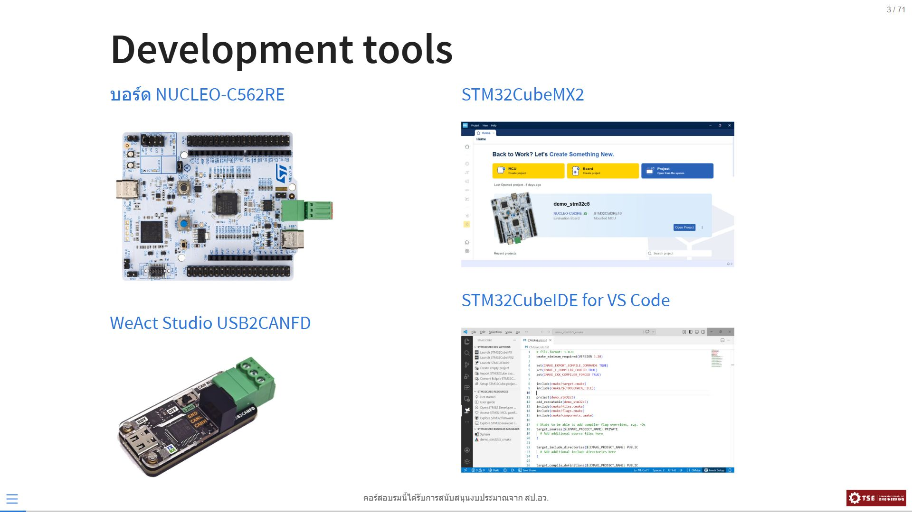
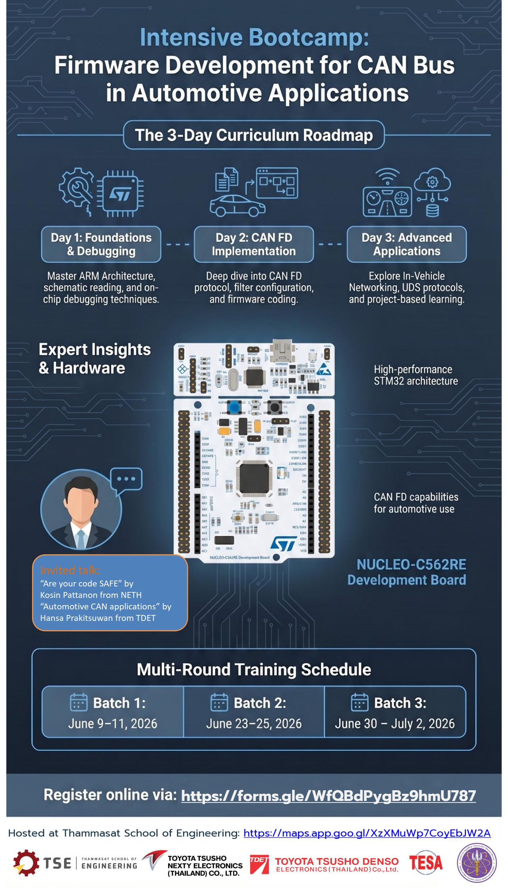

# Repository สำหรับคอร์สอบรม การพัฒนาเฟิร์มแวร์สำหรับระบบสื่อสาร CAN bus ในยานยนต์
Repository นี้เป็นการรวบรวมเนื้อหาและตัวอย่างของคอร์สอบรม **การพัฒนาเฟิร์มแวร์สำหรับระบบสื่อสาร CAN bus ในยานยนต์** ที่ได้รับการสนับสนุนจาก สำนักปลัดกระทรวงการอุดมศึกษา วิทยาศาสตร์ วิจัยและนวัตกรรม (สป.อว.) ภายใต้กรอบโครงการเรียนรู้ตลอดชีวิตและพัฒนาทักษะเพื่ออนาคต (Upskill/Reskill) ประจำปีงบประมาณ พ.ศ. 2569 

## หลักการและเหตุผล
ยานยนต์สมัยใหม่ (Next-Generation Automotive) และยานยนต์ไฟฟ้า (Electric Vehicles: EV) มีโครงสร้างทางเทคโนโลยีที่พึ่งพาการควบคุมด้วยระบบอิเล็กทรอนิกส์และซอฟต์แวร์ (Software-Defined Vehicles)  หัวใจสำคัญของการทำงานคือ ระบบสมองกลฝังตัว (Embedded Systems) และ เครือข่ายการสื่อสารภายในรถยนต์ (In-Vehicle Networking) ซึ่งใช้โปรโตคอลมาตรฐานอย่าง CAN bus (Controller Area Network) เป็นแกนกลางในการรับส่งข้อมูลระหว่างอุปกรณ์ควบคุมต่างๆ (ECUs)  อย่างไรก็ตาม สถานการณ์ในประเทศไทยกำลังเผชิญกับช่องว่างทางทักษะที่สำคัญ 2 ประการในการเข้าถึงและพัฒนาผลิตภัณฑ์ที่เกี่ยวข้องกับระบบอิเล็กทรอนิกส์ในยานยนต์

- ภาคการศึกษา: การเรียนการสอนในปัจจุบันมักเน้นการใช้งานฮาร์ดแวร์ระดับเริ่มต้น เช่น Arduino ซึ่งช่วยให้เรียนรู้ได้เร็วแต่ขาดความเข้าใจเชิงลึกในสถาปัตยกรรมของหน่วยประมวลผล เช่น การตอบสนองเหตุการณ์แบบเรียลไทม์ และการดีบั๊ก (Debugging) ซึ่งเป็นทักษะจำเป็นสำหรับการทำงานจริงในอุตสาหกรรม
- ภาคอุตสาหกรรม: ผู้ประกอบการผลิตชิ้นส่วนยานยนต์ไทยจำนวนมากมีความเชี่ยวชาญด้านชิ้นส่วนเครื่องกลและอิเล็กทรอนิกส์ แต่กำลังประสบปัญหาในการปรับตัวเพื่อสร้างผลิตภัณฑ์ใหม่ที่มีระบบประมวลผลฝังตัว เพื่อรองรับตลาดยานยนต์สมัยใหม่/EV เนื่องจากขาดแคลนบุคลากรที่มีความสามารถในการพัฒนาและทดสอบซอฟต์แวร์ยานยนต์

โครงการนี้มีเป้าหมายที่จะส่งเสริมการพัฒนาทักษะวิศวกรรมเชิงลึก โดยใช้การอบรมเชิงปฏิบัติการด้วยฮาร์ดแวร์มาตรฐานที่นิยมใช้ในอุตสาหกรรม และอุปกรณ์รับส่งสัญญาณ CAN bus  หลักสูตรครอบคลุมตั้งแต่วิธีการออกแบบ การเขียนเฟิร์มแวร์ การใช้เครื่องมือวัดและทดสอบสัญญาณ ไปจนถึงเทคนิคการตรวจสอบความถูกต้องของระบบ  นอกจากนี้ ผลลัพธ์ของโครงการจะถูกนำไปพัฒนาต่อยอดเป็น หลักสูตรต้นแบบ (Reference Curriculum) สำหรับสถาบันการศึกษาอื่น เพื่อสร้างกำลังคนสมรรถนะสูงเข้าสู่ห่วงโซ่อุปทานของอุตสาหกรรมยานยนต์ไทย

โครงการนี้เป็นการต่อยอดการอบรมเชิงปฏิบัติการที่ภาควิชาวิศวกรรมไฟฟ้าและคอมพิวเตอร์ มหาวิทยาลัยธรรมศาสตร์เคยร่วมมือกับบริษัทโตโยต้า ทูโช เน็กซ์ตี อิเล็กทรอนิกส์ (ไทยแลนด์) จำกัด (NETH) และ บริษัทโตโยต้า ทูโช่ เด็นโซ่ อิเล็คทรอนิคส์ (ไทยแลนด์) จำกัด (TDET) ในปี พ.ศ.2562   การอบรมในครั้งนั้นมีทีมงานจากบริษัท NETH/TDET มาร่วมให้คำปรึกษาด้านเนื้อหา เป็นวิทยากร และประเมินผลการเรียนรู้ เพื่อให้มั่นใจว่าทักษะที่ผู้เรียนได้รับตรงกับความต้องการของตลาดแรงงานอย่างแท้จริง  ข้อแตกต่างจากเนื้อหาของหลักสูตรเดิมคือ การเปลี่ยนจากบอร์ด STM32F4 Discovery ที่ใช้หน่วยประมวลผล STM32F407 ที่เป็น CAN มาตรฐานเป็น[บอร์ด NUCLEO-C562RE](https://www.st.com/en/evaluation-tools/nucleo-c562re.html) ซึ่งรองรับการสื่อสารด้วยมาตรฐาน CAN-FD (Controller Area Network Flexible Data-Rate)   โครงข่ายสื่อสารในยานยนต์สมัยใหม่/EV ต่างก็ใช้มาตรฐาน CAN-FD เนื่องจากรองรับการส่งข้อมูลได้มากขึ้น ทำให้ผู้เข้าอบรมในรอบนี้จะได้รับการถ่ายทอดความรู้/ทักษะที่ทันสมัย

## เป้าหมายของโครงการ

1. เพื่อพัฒนาทักษะเชิงลึก (Upskill/Reskill) ด้านการออกแบบและพัฒนาเฟิร์มแวร์สำหรับระบบสื่อสาร CAN bus ให้แก่นักศึกษาที่กำลังเข้าสู่ตลาดแรงงานและบุคลากรในภาคอุตสาหกรรมที่เกี่ยวข้อง
2. เพื่อยกระดับความสามารถในการใช้เครื่องมือทางวิศวกรรมที่จำเป็นในอุตสาหกรรมยานยนต์สมัยใหม่ เช่น การใช้งานอุปกรณ์ดีบั๊กเกอร์ การวิเคราะห์สัญญาณด้วยเครื่องมือวัดเฉพาะทาง และการอ่านแบบวงจรพิมพ์ (PCB) สำหรับระบบฝังตัว
3. เพื่อสร้างต้นแบบหลักสูตรด้านซอฟต์แวร์ยานยนต์ที่ผ่านการตรวจสอบและยอมรับจากผู้เชี่ยวชาญในภาคอุตสาหกรรม สำหรับใช้เป็นแนวทางในการพัฒนาการเรียนการสอนของสถาบันการศึกษาให้ทันต่อเทคโนโลยี
4. เพื่อสนับสนุนผู้ประกอบการผลิตชิ้นส่วนยานยนต์ไทยให้มีบุคลากรที่มีศักยภาพในการวิจัยและพัฒนาผลิตภัณฑ์ใหม่ เพื่อรองรับการเปลี่ยนแปลงห่วงโซ่อุปทานของยานยนต์สมัยใหม่

## กำหนดการจัดอบรม
คอร์สอบรมนี้จัดขึ้นที่ห้องประชุมภาควิชาวิศวกรรมไฟฟ้าและคอมพิวเตอร์ [(ห้อง วจ.406 ชั้น 4 ตึกปฏิบัติการและวิจัย)](https://maps.app.goo.gl/JNUfaH9Xf5AJHnCg8) คณะวิศวกรรมศาสตร์ มหาวิทยาลัยธรรมศาสตร์ 

## ภาพรวมของหลักสูตร

- วันที่ 1 กระบวนการพัฒนาเฟิร์มแวร์
  - ฮาร์ดแวร์ของการอบรม: บอร์ด NUCLEO-C562RE
  - ชุดเครื่องมือพัฒนา: STM32Cube for VS Code
  - กระบวนการและเทคนิคการพัฒนาเฟิร์มแวร์
  - **workshop**: เฟิร์มแวร์ USB2ADC - SCPI protocol
- วันที่ 2 การสื่อสารด้วย CAN FD
  - เครือข่าย Controller Area Network
  - การใช้งาน FDCAN ของ STM32
  - **workshop**: เฟิร์มแวร์ USB2CAN - SLCAN protocol
- วันที่ 3 เครือข่ายสื่อสารในยานยนต์
  - **Invited talk (NETH/TDET)**: Are your code SAFE? โดยคุณโกสินทร์ และ automotive CAN application โดยคุณหรรษา
  - **workshop**: เฟิร์มแวร์ ECU - UDS protocol

